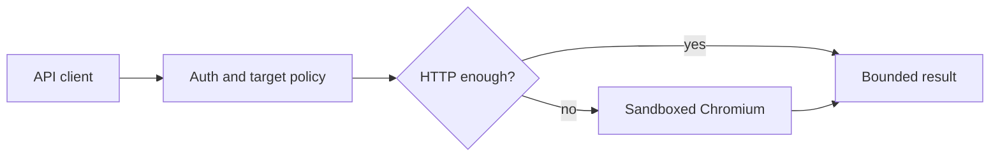

<div align="center">

# OpenBrowse

**Self-hosted browser execution for the requests that need a real browser.**

<a href="#start-here"></a>
<a href="docs/browserless-feature-audit.md"></a>
<a href="docs/architecture.md"></a>


</div>

Most pages do not need Chromium. OpenBrowse starts with an HTTP request and
only opens a sandboxed browser when JavaScript, layout, screenshots, PDFs, or
downloads make it necessary. One authenticated service handles the request,
the browser lifecycle, and the resulting artifacts.



## At a glance

| | |
|---|---|
| **HTTP first** | Fetch public content directly; escalate only for client-rendered pages. |
| **Owned state** | Sessions, profiles, artifacts, replays, proxies, and webhooks belong to the API key that created them. |
| **Controlled browser work** | Process-tree memory admission, bounded contexts, worker health/draining, restart backoff, timeouts, and bounded outputs. |
| **Core API** | Fetch, render, extract, screenshots, PDFs, and owned browser sessions. |

## Start here

Docker is the supported production path.

```bash
export OPENBROWSE_API_KEYS='replace-with-your-api-key'
export OPENBROWSE_ENCRYPTION_KEY="$(openssl rand -base64 48)"

docker compose up -d --build
npm run verify:docker
```

Keep the encryption key in your secret store and reuse it on every restart.
Changing it makes persisted profiles, proxy credentials, and session state
unreadable.

The Docker check waits for the service, opens a live browser session, verifies
the VNC handshake, and confirms the secure default:

```json
{"vnc":"RFB handshake verified","rawBridge":"disabled by operator policy"}
```

<a href="deploy/kubernetes/README.md"></a>

For local development:

```bash
npm ci
cp .env.example .env
# Set OPENBROWSE_API_KEYS and OPENBROWSE_ENCRYPTION_KEY in .env.
npx playwright install chromium
npm run build
node --env-file=.env dist/index.js
```

## Make a request

```bash
curl -X POST http://localhost:3000/v1/fetch \
  -H "Authorization: Bearer $OPENBROWSE_API_KEY" \
  -H 'Content-Type: application/json' \
  -d '{
    "url": "https://example.com",
    "strategy": "auto",
    "output": ["html", "markdown", "links"]
  }'
```

`auto` uses HTTP first and escalates to Chromium only when the response looks
client-rendered. The OpenAPI document is available at `/openapi.json`; the
local product UI is at `/landing`.

## Core API and optional interfaces

| Interface | What it is for | Authentication |
|---|---|---|
| Native REST | **Core**: fetch, render, extract, screenshots, PDFs, sessions, artifacts, and jobs. | `Authorization: Bearer <key>` |
| Migration aliases | Compatibility layer for staged Browserless migrations. | `?token=<key>` |
| BrowserQL and MCP | Optional bounded query/tool interfaces over the same execution core. | Bearer token or migration token |
| VNC viewer | Optional authenticated, session-scoped browser desktop for Docker live-viewer sessions. | Query token, required by browser WebSockets |

Read [Browserless compatibility](docs/browserless-feature-audit.md) for the
supported migration surface and [architecture](docs/architecture.md) for the
request, storage, and isolation model.

## Boundaries that stay in place

- Private, loopback, link-local, metadata, multicast, and DNS-resolved
  internal targets are rejected before navigation and after redirects.
- Docker runs Chromium as a non-root user with the sandbox enabled, a read-only
  root filesystem, dropped capabilities, resource limits, and the bundled
  seccomp profile.
- Persistent session state, browser profiles, and proxy credentials are
  encrypted with AES-256-GCM. Jobs, artifacts, replays, profiles, proxies, and
  webhooks stay within their API-key owner boundary.
- Raw CDP/Playwright bridges, full Lighthouse, and cache purge are off by
  default. Turn them on only in an isolated worker deployment with explicit
  egress controls.
- CAPTCHA challenges return `423 CAPTCHA_DETECTED`. There is no solver,
  stealth mode, fingerprint randomization, or protection bypass.

Application checks are defense in depth. A production deployment still needs a
DNS-aware egress proxy or firewall that blocks private and metadata ranges at
connection time.

## Repository map

```text
src/                    service, execution engine, storage, and routes
frontend/landing/       React landing page and live viewer
deploy/                 Docker, seccomp, VNC, and Kubernetes assets
scripts/                Docker and feature verification scripts
tests/                  unit, security, and integration coverage
```

The Kubernetes manifest is intentionally single-replica because the default
SQLite store has one writer. It expects an egress proxy and a node-installed
seccomp profile. Read the
[Kubernetes deployment guide](deploy/kubernetes/README.md) before applying it.

## Verify changes

```bash
npm run typecheck
npm test
npm run test:integration
npm run test:raw-bridge
npm run build
npm audit --omit=dev --audit-level=high
```

GitHub Actions runs the same checks and the Docker verifier for pushes and pull
requests.

## Benchmark and soak validation

Use measured data from your own deployment; OpenBrowse does not publish
synthetic capacity claims. The soak runner mixes four HTTP-first requests with
one forced browser render, reports p50/p95 latency, failures, worker state,
and Node, Chromium-tree, and cgroup memory snapshots.

```bash
export OPENBROWSE_BENCHMARK_API_KEY="$OPENBROWSE_API_KEY"
export OPENBROWSE_BENCHMARK_TARGET='https://example.com'
export OPENBROWSE_BENCHMARK_REQUESTS=1000
export OPENBROWSE_BENCHMARK_CONCURRENCY=4
npm run benchmark:soak > benchmark.json
```

For reliability evidence, run the same command with a controlled target for
one hour, six hours, and twenty-four hours. Keep the JSON output with the
deployment configuration and inspect `failures`, `memory`, and the p95 values
before calling a capacity figure production-ready.

## License and notices

Apache-2.0. The package metadata declares the license; retain the
[third-party notices](docs/third-party-notices.md) when redistributing the
project.
