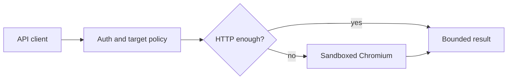

<div align="center">

# OpenBrowse

**Self-hosted browser execution for the requests that need a real browser.**

<a href="#start-here"></a>
<a href="docs/browserless-feature-audit.md"></a>
<a href="docs/architecture.md"></a>


</div>

Most pages do not need Chromium. OpenBrowse starts with an HTTP request and
only opens a sandboxed browser when JavaScript, layout, screenshots, PDFs, or
downloads make it necessary. One authenticated service handles the request,
the browser lifecycle, and the resulting artifacts.



## At a glance

| | |
|---|---|
| **HTTP first** | Fetch public content directly; escalate only for client-rendered pages. |
| **Owned state** | Sessions, profiles, artifacts, replays, proxies, and webhooks belong to the API key that created them. |
| **Controlled browser work** | Process-tree memory admission, bounded contexts, worker health/draining, restart backoff, timeouts, and bounded outputs. |
| **Core API** | Fetch, render, extract, screenshots, PDFs, and owned browser sessions. |

## Start here

Docker is the supported production path.

```bash
export OPENBROWSE_API_KEYS='replace-with-your-api-key'
export OPENBROWSE_ENCRYPTION_KEY="$(openssl rand -base64 48)"

docker compose up -d --build
npm run verify:docker
```

Keep the encryption key in your secret store and reuse it on every restart.
Changing it makes persisted profiles, proxy credentials, and session state
unreadable.

The Docker check waits for the service, opens a live browser session, verifies
the VNC handshake, and confirms the secure default:

```json
{"vnc":"RFB handshake verified","rawBridge":"disabled by operator policy"}
```

<a href="deploy/kubernetes/README.md"></a>

For local development:

```bash
npm ci
cp .env.example .env
# Set OPENBROWSE_API_KEYS and OPENBROWSE_ENCRYPTION_KEY in .env.
npx playwright install chromium
npm run build
node --env-file=.env dist/index.js
```

## Make a request

```bash
curl -X POST http://localhost:3000/v1/fetch \
  -H "Authorization: Bearer $OPENBROWSE_API_KEY" \
  -H 'Content-Type: application/json' \
  -d '{
    "url": "https://example.com",
    "strategy": "auto",
    "output": ["text", "markdown", "metadata", "article", "links"]
  }'
```

For JavaScript applications, `auto` first fetches the HTTP response, detects a
client-rendered shell, then uses Chromium. The default browser fallback first
observes meaningful structural DOM changes briefly, then waits for it to become
quiet (600 ms quiet window, 4 s maximum), not for global network idle. Small
text-only updates such as clocks do not keep the wait alive. This avoids being
held hostage by analytics, polling, or WebSockets.

When you know a page's readiness signal, override it with a typed wait:

```json
{
  "url": "https://example.com/profile",
  "strategy": "auto",
  "wait": {
    "type": "selector",
    "selector": "[data-profile-loaded]",
    "state": "visible"
  },
  "output": ["markdown"]
}
```

Choose a backend explicitly when the workload needs it. Patchright is enabled
by default and uses the same pinned Chromium installation as Playwright.
CloakBrowser, Camoufox, and Clearcote are operator-enabled because they require
a separately licensed or provisioned browser artifact. Raw Chromium options
are deliberately limited to `--fingerprint...` arguments; sandbox,
remote-debugging, and proxy switches cannot be injected through this field.

```json
{
  "url": "https://example.com",
  "strategy": "browser",
  "browserBackend": "cloakbrowser-chromium",
  "browserOptions": {
    "fingerprintArgs": [
      "--fingerprint=381204",
      "--fingerprint-platform=windows"
    ],
    "humanize": true,
    "humanPreset": "careful",
    "humanConfig": {
      "typing_delay": 90,
      "mouse_overshoot_chance": 0.1
    }
  },
  "output": ["text", "provenance"]
}
```

If a rendered page still contains a recognized challenge, OpenBrowse attempts
each enabled, operation-compatible backend at most once: the requested/default
backend, Patchright, Clearcote, Camoufox, then CloakBrowser. The result reports
whether the challenge remained. BrowserQL `solve` uses the same bounded backend
escalation; it does not call an external CAPTCHA-solving service.

For an authorized flow that needs a person, create a headed session and
navigate atomically. OpenBrowse keeps that exact BrowserContext alive while the
operator uses the authenticated viewer, then a bounded wait resumes only after
the challenge document is gone:

```bash
curl -sS http://localhost:3000/v1/sessions \
  -H "Authorization: Bearer $OPENBROWSE_API_KEY" \
  -H "Content-Type: application/json" \
  -d '{"ttlSeconds":900,"liveViewer":true,"startUrl":"https://example.com"}'

curl -sS -X POST http://localhost:3000/v1/sessions/SESSION_ID/challenge/wait \
  -H "Authorization: Bearer $OPENBROWSE_API_KEY" \
  -H "Content-Type: application/json" \
  -d '{"timeoutMs":60000,"pollIntervalMs":500}'
```

The status response exposes only whether `cf_clearance` exists; cookie values
remain inside the encrypted, API-key-owned session. For properties you control,
use Cloudflare's official dummy keys in automated tests and pre-clearance in
production instead of challenging CI browsers.

Supported wait types are `domcontentloaded`, `load`, `networkidle`, `selector`,
`delay`, and `stability`. The legacy `waitUntil` field remains supported but
cannot be combined with `wait`.

`auto` uses HTTP first and escalates to Chromium only when the response looks
client-rendered. The OpenAPI document is available at `/openapi.json`; the
local product UI is at `/landing`.

Every fetch explains what happened. `execution.plan` contains the deterministic
stage order, decision reason, attempt budget, cache eligibility, and estimated
memory class. `execution.backendAttempts` and `timings` distinguish HTTP,
browser acquisition, navigation, settle, and extraction time. Article output
adds normalized metadata, readable text, word count, access signals, and source
provenance without pretending that restricted text was retrieved.

```json
{
  "strategy": "browser",
  "attempted": ["http", "browser"],
  "execution": {
    "plan": {
      "stages": ["http", "browser"],
      "reason": "client-rendered-shell",
      "attemptBudget": 2,
      "browserBackend": "playwright-chromium"
    },
    "backendAttempts": ["playwright-chromium"],
    "selectedBackend": "playwright-chromium"
  }
}
```

## Core API and optional interfaces

| Interface | What it is for | Authentication |
|---|---|---|
| Native REST | **Core**: fetch, render, extract, screenshots, PDFs, sessions, artifacts, and jobs. | `Authorization: Bearer <key>` |
| Migration aliases | Compatibility layer for staged Browserless migrations. | `?token=<key>` |
| BrowserQL and MCP | Optional bounded query/tool interfaces over the same execution core. | Bearer token or migration token |
| VNC viewer | Optional authenticated, session-scoped browser desktop for Docker live-viewer sessions. | Query token, required by browser WebSockets |

Read [Browserless compatibility](docs/browserless-feature-audit.md) for the
supported migration surface and [architecture](docs/architecture.md) for the
request, storage, and isolation model.

`/map` uses the same HTTP-first planner. If an HTTP response is only an SPA
shell, OpenBrowse renders it and discovers same-origin `href` and `data-href`
routes from the settled DOM. It does not click unknown controls or submit forms.

## Boundaries that stay in place

- Private, loopback, link-local, metadata, multicast, and DNS-resolved
  internal targets are rejected before navigation and after redirects. Direct
  HTTP connections pin the validated DNS answer for that hop.
- Docker runs Chromium as a non-root user with the sandbox enabled, a read-only
  root filesystem, dropped capabilities, resource limits, and the bundled
  seccomp profile.
- Persistent session state, browser profiles, and proxy credentials are
  encrypted with AES-256-GCM. Jobs, artifacts, replays, profiles, proxies, and
  webhooks stay within their API-key owner boundary.
- Raw CDP/Playwright bridges, full Lighthouse, and cache purge are off by
  default. Turn them on only in an isolated worker deployment with explicit
  egress controls.
- Challenge handling is bounded to configured browser backends. There is no
  external solver or unbounded retry loop. Backend fingerprint and
  humanization controls are explicit request fields and never change sandbox,
  authentication, SSRF, timeout, or output limits.

Application checks are defense in depth. A production deployment still needs a
DNS-aware egress proxy or firewall that blocks private and metadata ranges at
connection time.

## Repository map

```text
src/                    service, execution engine, storage, and routes
frontend/landing/       React landing page and live viewer
deploy/                 Docker, seccomp, VNC, and Kubernetes assets
scripts/                Docker and feature verification scripts
tests/                  unit, security, and integration coverage
```

The Kubernetes manifest is intentionally single-replica because the default
SQLite store has one writer. It expects an egress proxy and a node-installed
seccomp profile. Read the
[Kubernetes deployment guide](deploy/kubernetes/README.md) before applying it.

## Verify changes

```bash
npm run typecheck
npm test
npm run test:integration
npm run test:raw-bridge
npm run build
npm audit --omit=dev --audit-level=high
```

GitHub Actions runs the same checks and the Docker verifier for pushes and pull
requests.

## Benchmark and soak validation

Use measured data from your own deployment; OpenBrowse does not publish
synthetic capacity claims. The soak runner mixes four forced-HTTP requests with
one forced browser render, reports requested and actual execution strategies,
backend use, p50/p95/p99 latency, failures, worker state,
and Node, Chromium-tree, and cgroup memory snapshots. Long-running mode also
records periodic snapshots, so RSS growth is visible instead of inferred from
only the start and end of a test. In a Linux container, admission uses the
cgroup charge; process-tree RSS remains a recycling diagnostic and is reported
alongside it, including peak divergence and recycling transitions.

```bash
export OPENBROWSE_BENCHMARK_API_KEY="$OPENBROWSE_API_KEY"
export OPENBROWSE_BENCHMARK_TARGET='https://example.com'
# Or cycle through a reviewed fixture set:
# export OPENBROWSE_BENCHMARK_TARGETS='https://static.example,https://spa.example,https://news.example/article'
export OPENBROWSE_BENCHMARK_REQUESTS=1000
export OPENBROWSE_BENCHMARK_CONCURRENCY=4
npm run benchmark:soak > benchmark.json
```

For reliability evidence, run the same command with a controlled target for
one hour, six hours, and twenty-four hours. Keep the JSON output with the
deployment configuration and inspect `failures`, `memory.samples`, and the
p95/p99 values before calling a capacity figure production-ready.

```bash
for hours in 1 6 24; do
  OPENBROWSE_BENCHMARK_DURATION_SECONDS=$((hours * 3600)) \
    npm run benchmark:soak > "benchmark-${hours}h.json"
done
```

See [the benchmark protocol](docs/benchmarks/README.md) for the required
container settings, target characteristics, report schema, and publication
criteria. Capacity numbers belong in a dated report with its exact
configuration and raw JSON; the repository deliberately does not substitute
made-up figures for that evidence.

For extraction quality, use the assertion-backed 100–500 page
[corpus protocol](docs/benchmarks/README.md#extraction-corpus-fidelity). It
tests the deployed `auto` path across real authorised pages and reports every
failed content assertion instead of inferring fidelity from request success.
Assertions cover Markdown, links, article word count/title/access state,
selected strategy, and provenance.

## Browser backend policy

OpenBrowse ships five typed browser adapters. Stock Playwright remains the
default. Patchright is the maintained Node-native replacement for
`invisible_playwright` and is enabled by default. CloakBrowser and Camoufox are
optional package integrations; Clearcote is an executable-path adapter. These
three remain disabled until the operator provisions the browser, reviews its
terms, and adds it to `OPENBROWSE_BROWSER_BACKENDS`.

Workers are isolated by backend and backend-specific fingerprint/humanization
profile. OpenBrowse never chooses a backend from a hostname, and it never
forwards raw license keys, proxy credentials, or unrestricted Chromium
arguments from an API caller. See
[backend decisions](docs/browser-backends.md) for installation, licensing, and
runtime details.

## License and notices

Apache-2.0. The package metadata declares the license; retain the
[third-party notices](docs/third-party-notices.md) when redistributing the
project.
